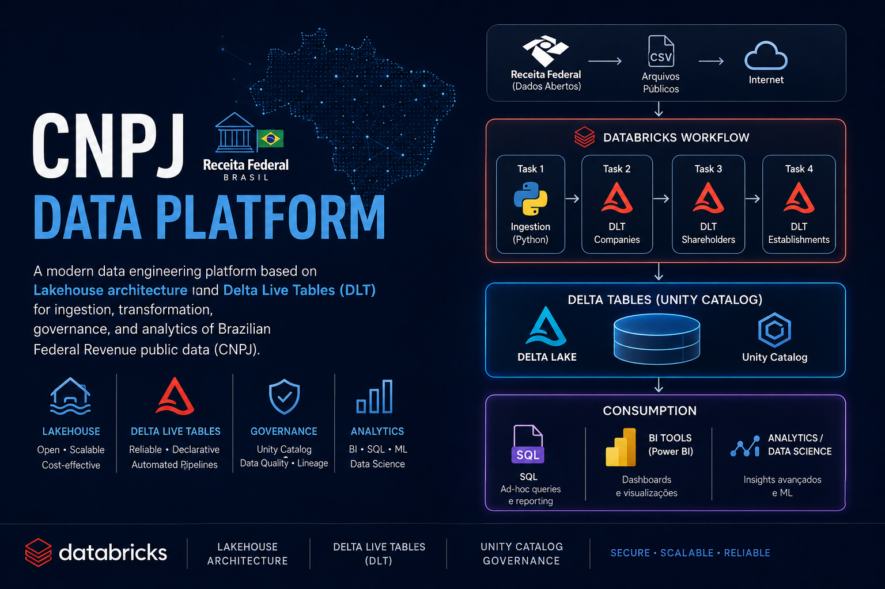
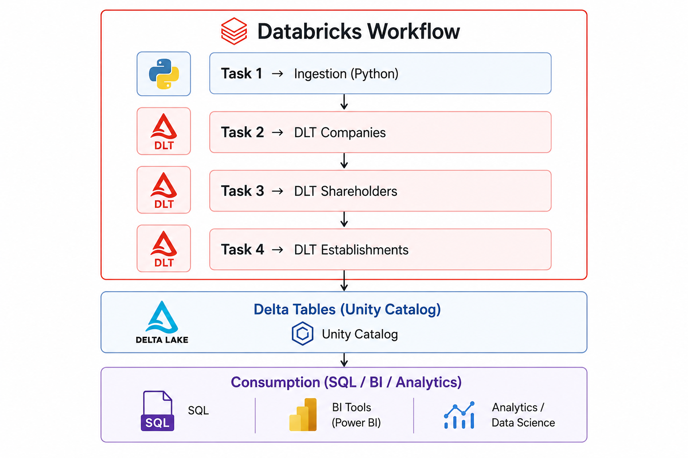

A modern data engineering platform based on Lakehouse architecture using Delta Live Tables (DLT) for ingestion, transformation, governance, and analytics of Brazilian Federal Revenue public data (CNPJ).

---

## Overview

This project implements an end-to-end data pipeline following the **Medallion Architecture (Bronze, Silver, Gold)** using Databricks.

The solution is responsible for:

* Ingesting public data from the Brazilian Federal Revenue
* Structuring data into layered architecture (raw → bronze → silver → gold)
* Cleaning and standardizing datasets
* Applying declarative data quality rules
* Generating analytical datasets for consumption

---

## Architecture

```
Databricks Workflow
│
├── Task 1 → Ingestion (Python)
│
├── Task 2 → DLT Companies
│
├── Task 3 → DLT Shareholders
│
└── Task 4 → DLT Establishments
        ↓
Delta Tables (Unity Catalog)
        ↓
Consumption (SQL / BI / Analytics)
```

---

## Tech Stack

| Layer         | Technology                                 |
| ------------- | ------------------------------------------ |
| Processing    | PySpark                                    |
| Orchestration | Delta Live Tables + Workflows              |
| Storage       | Delta Lake                                 |
| Platform      | Databricks                                 |
| Data Source   | Brazilian Federal Revenue (CNPJ Open Data) |

---

## Project Structure

```
cnpj-dlt-pipeline/
│
├── ingestion/
│   └── ingestion_cnpj.py
│
├── dlt/
│   ├── companies/
│   │   └── dlt_companies.py
│   │
│   ├── shareholders/
│   │   └── dlt_shareholders.py
│   │
│   └── establishments/
│       └── dlt_establishments.py
│
├── config/
├── notebooks/
└── README.md
```

---

## Data Ingestion

Data is sourced from the Brazilian Federal Revenue (CNPJ open dataset) and provided as ZIP files.

### Steps:

1. Download datasets
2. Extract files
3. Upload to Data Lake (`/mnt/cnpj/raw/`)

---

## Domain-Oriented DLT Pipelines

The architecture uses multiple independent DLT pipelines organized by data domain:

* Companies
* Shareholders
* Establishments

Each pipeline implements its own **Bronze → Silver → Gold** transformations.

---

### Example: Companies Pipeline

```python
@dlt.table
def bronze_companies():
    return (
        spark.read
        .format("csv")
        .option("sep", ";")
        .load("/mnt/cnpj/raw/empresas/")
    )

@dlt.table
@dlt.expect("cnpj_not_null", "cnpj_basico IS NOT NULL")
def silver_companies():
    return dlt.read("bronze_companies").dropDuplicates(["cnpj_basico"])
```

---

## Orchestration

Orchestration is handled using **Databricks Workflows**, coordinating all pipelines:

```
Task 1 (Ingestion)
   ↓
Task 2 (Companies)
Task 3 (Shareholders)
Task 4 (Establishments)
```

* Ingestion runs first
* DLT pipelines run in parallel
* Pipelines are independent and decoupled

This design enables scalability, modularity, and selective reprocessing.

---

## Data Quality

DLT allows defining built-in data quality rules:

* `@dlt.expect` → validation
* `@dlt.expect_or_drop` → drop invalid records
* `@dlt.expect_or_fail` → fail pipeline

Example:

```python
@dlt.expect_or_drop("valid_capital", "capital_social >= 0")
```

---

## Pipeline Configuration

Key parameters:

* **Source**: notebook or Git repository
* **Target Schema**: `cnpj_dlt`
* **Storage Location**: `/mnt/cnpj/dlt/`
* **Mode**:

  * Triggered (batch)
  * Continuous (streaming)

---

## Data Consumption

Data can be consumed via:

* Databricks SQL
* BI tools (Power BI, Tableau)
* Analytical notebooks
* APIs (optional)

---

## Future Enhancements

* Join companies, shareholders, and establishments
* Enrich with geolocation data (IBGE)
* Build interactive dashboards
* Implement incremental ingestion (Auto Loader)
* Advanced data quality testing
* Feature Store for Machine Learning

---

## Use Cases

* Company distribution by sector (CNAE)
* Geographic distribution of companies
* Company profiling by size
* Business landscape analysis

---

## Project Goals

Demonstrate expertise in:

* Modern Data Engineering (Lakehouse architecture)
* Distributed processing with Spark
* Declarative pipelines with DLT
* Data quality and governance
* Analytical data modeling

---

## Status

In development

---

## Contributing

Feel free to open issues or contribute improvements.

---

## License

This project uses publicly available data from the Brazilian Federal Revenue...